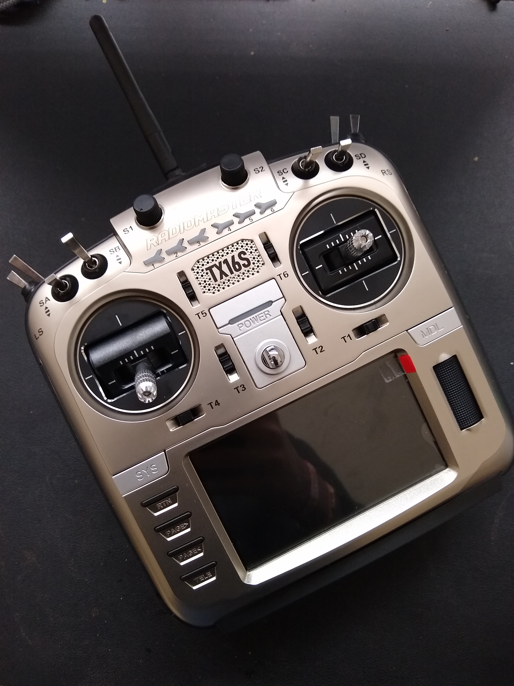

# tx16s
This repo contains files for TX16s radio transmitter specific to Pegasus Drone.

- All flight models for Pegasus Drone, Pegasus Simulation and Medusa Drone are pre-built and ready to use.
- Control Sticks are calibrated.
- Controller's scripts are configured to bind FrSky X8R receiver.
- To alter any configuration or add new model refer [Open-Tx](https://www.open-tx.org/).
- Telemetry scripts are taken from [INAV LUA Telemetry](https://luatelemetry.readthedocs.io/en/latest/) and [FrSky Yapuu Telemetry](https://github.com/yaapu/FrskyTelemetryScript).

## Steps to setup TX16s:
- Insert SD card to laptop

```
$ sudo mount /dev/mmcblk0p1 /mnt
$ cp -r /PathToDir/TX16s /mnt/TX16s
```
